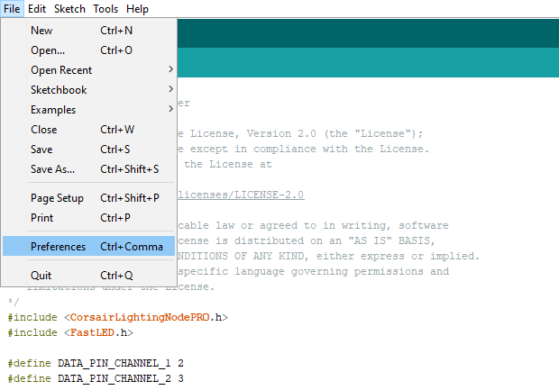
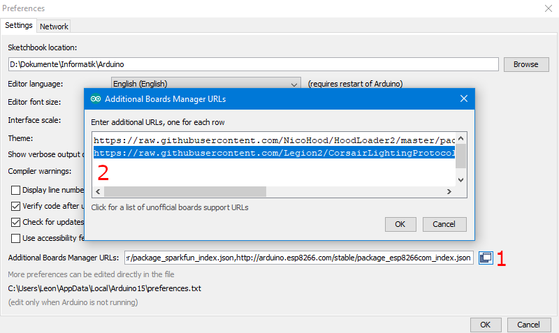
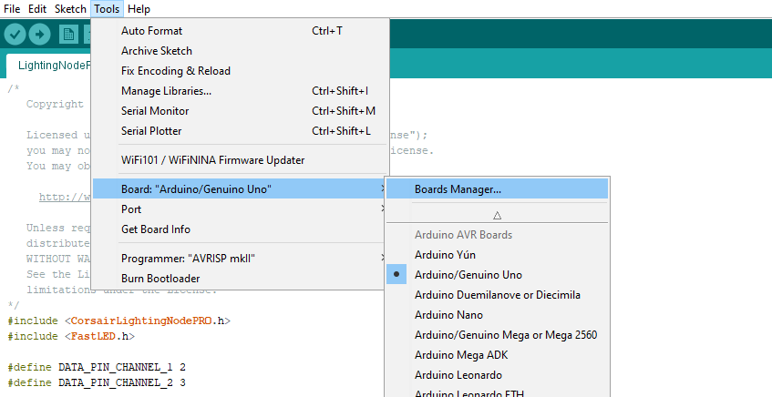
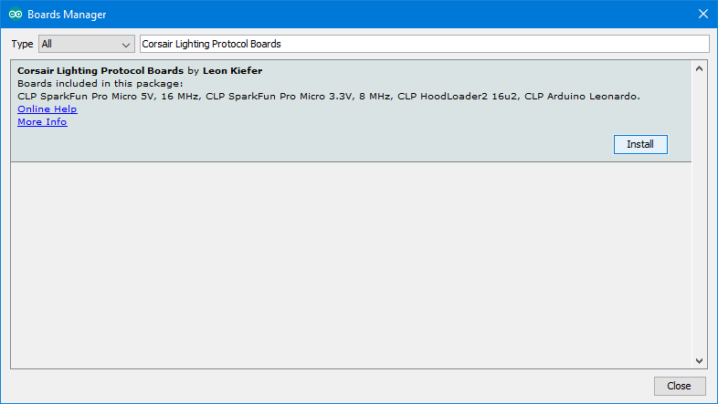
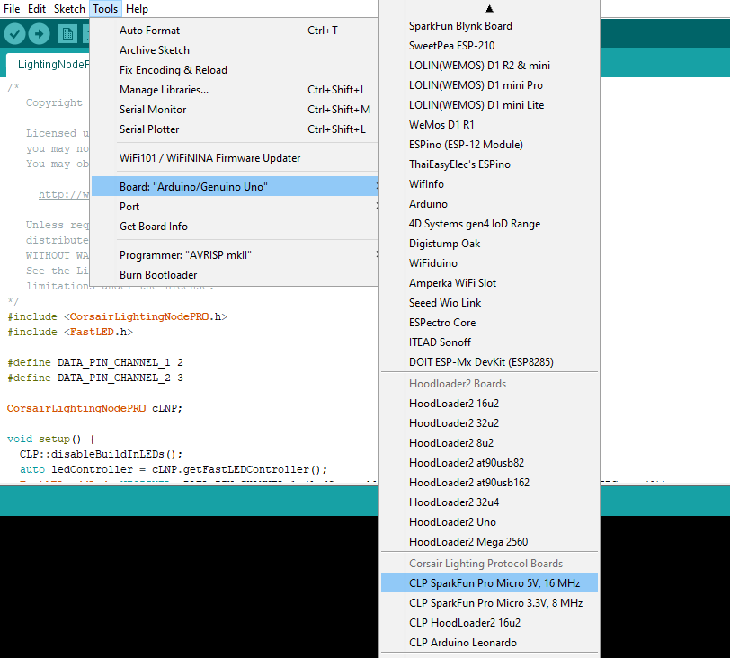
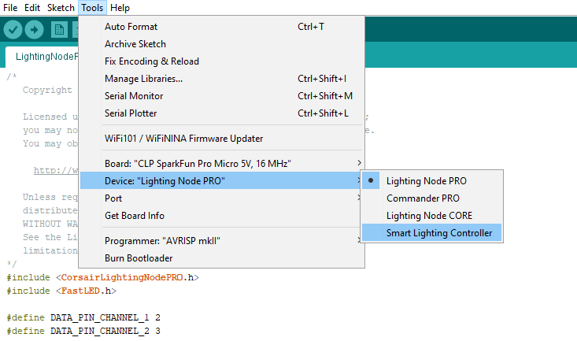
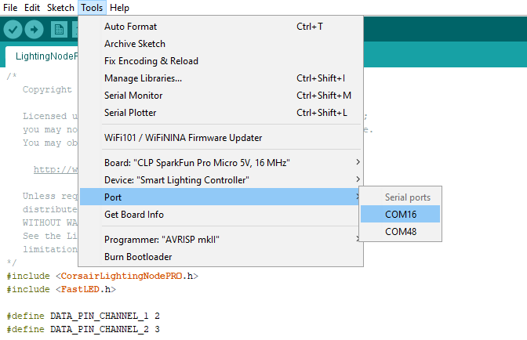

# Corsair Lighting Protocol Boards
Arduino board definitions for use with the [Corsair Lighting Protocol](https://github.com/Legion2/CorsairLightingProtocol) library.
These board definitions have modified USB settings so they can be used to simulate corsair devices.

## How to use these boards in Arduino
All boards can simply be installed in Arduino IDE via the Boards Manager.

package index URL:
```
https://raw.githubusercontent.com/Legion2/CorsairLightingProtocolBoards/master/package_Legion2_CorsairLightingProtocolBoards_index.json
```

1. Open the **Preferences** of the Arduino IDE.

   
1. Add the package index URL above in the **Additional Boards Manager URLs** field, and click OK.

   
1. Open the **Boards Manager** by opening the menu Tools->Board->Board Manager...

   
1. Search and install **Corsair Lighting Protocol Boards**

   
1. Select one of the boards under Corsair Lighting Protocol Boards in Tools->Board menu

   
1. Select one of the devices from corsair under Tools->Device

   
1. Select COM port under Tools->Port

   
1. Compile/Upload as usual

## License
This project is licensed under the Apache License Version 2.0.
